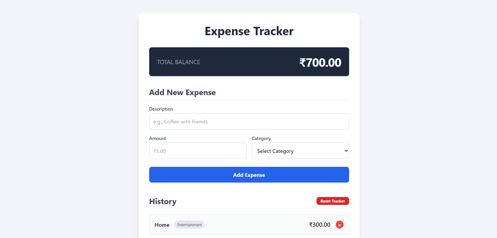

# 📊 Modern Expense Tracker

A sleek, full-stack web application for tracking personal expenses. Built with a modern tech stack, this project features a real-time responsive interface and a robust backend to manage your financial data.

 

  <a href="https://expense-tracker-sl0v.onrender.com" style="text-decoration: none;">
    
      🚀 View Live Demo
    
  </a>

 

## ✨ Core Features

* **Dynamic Dashboard**: Instantly add expenses with a description, amount, and category.
* **Real-time Updates**: The total balance and expense list update automatically without page reloads.
* **Complete History**: View a chronological list of all past expenses.
* **Effortless Deletion**: Remove single expenses with a click.
* **Total Reset**: A secure, confirmation-based option to wipe the slate clean and start fresh.

---

## 🛠️ Technology Stack

This project utilizes a modern, full-stack architecture:

* **Frontend**:
    * `HTML5`
    * `Tailwind CSS` for utility-first styling.
    * `JavaScript (ES6+)` for DOM manipulation and API communication.
* **Backend**:
    * `Node.js` as the JavaScript runtime environment.
    * `Express.js` for building the robust API.
* **Database**:
    * `MongoDB` as the NoSQL database.
    * `Mongoose` for elegant data modeling and object-relational mapping.

---

## ⚙️ How It Works

The application follows a classic **Model-View-Controller (MVC)** architecture on the backend.

1.  **View (Client)**: The user interacts with the Tailwind CSS-styled HTML page. JavaScript captures events (like form submissions) and sends requests to the backend API using `fetch`.
2.  **Routes (Server)**: The Express server receives the request and matches the URL endpoint to a specific controller function.
3.  **Controller (Server)**: The controller contains the business logic. It processes the request, interacts with the database model, and prepares a response.
4.  **Model (Server)**: The Mongoose model defines the data schema and communicates directly with the MongoDB database to create, read, update, or delete expense records.
5.  **Response**: The server sends data (or a confirmation message) back to the client as JSON, and JavaScript updates the webpage dynamically.

---

## 📡 API Endpoints

The backend API provides the following endpoints to manage expenses:

| Method | Endpoint              | Description                                  |
| :----- | :-------------------- | :------------------------------------------- |
| `GET`    | `/api/expense`       | Fetches a list of all current expenses.      |
| `POST`   | `/api/expense`       | Creates a new expense entry.                 |
| `DELETE` | `/api/expense/:id`   | Deletes a single expense by its unique ID.   |
| `DELETE` | `/api/expense`       | Deletes all expenses to reset the tracker.   |